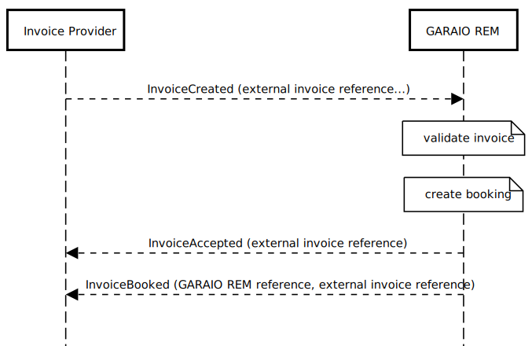
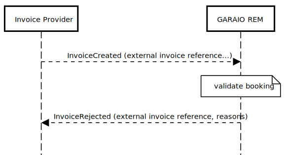
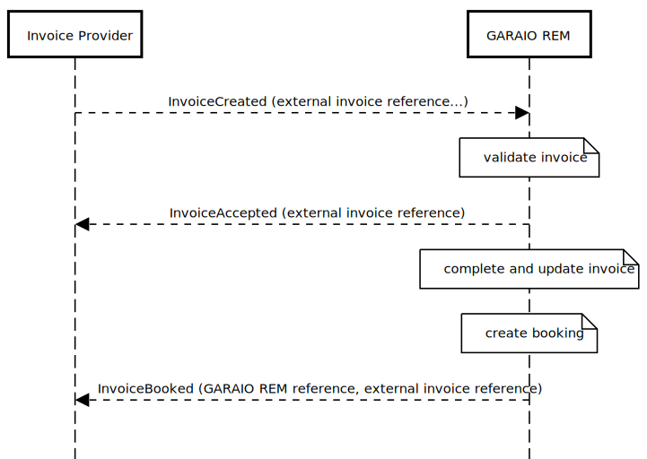
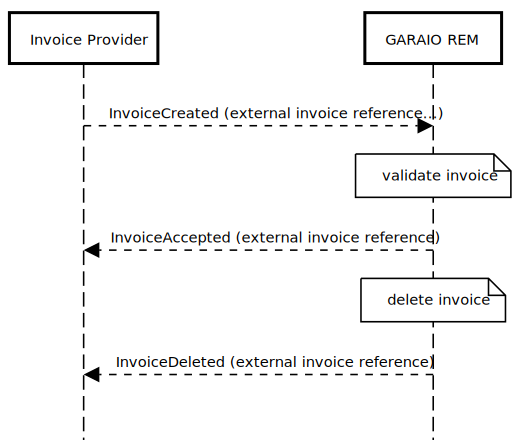
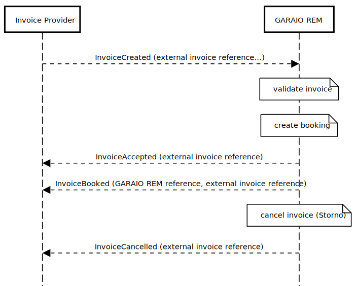
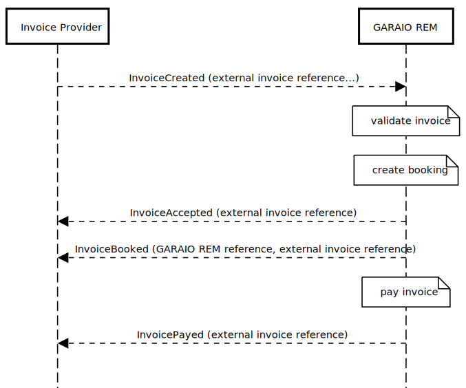
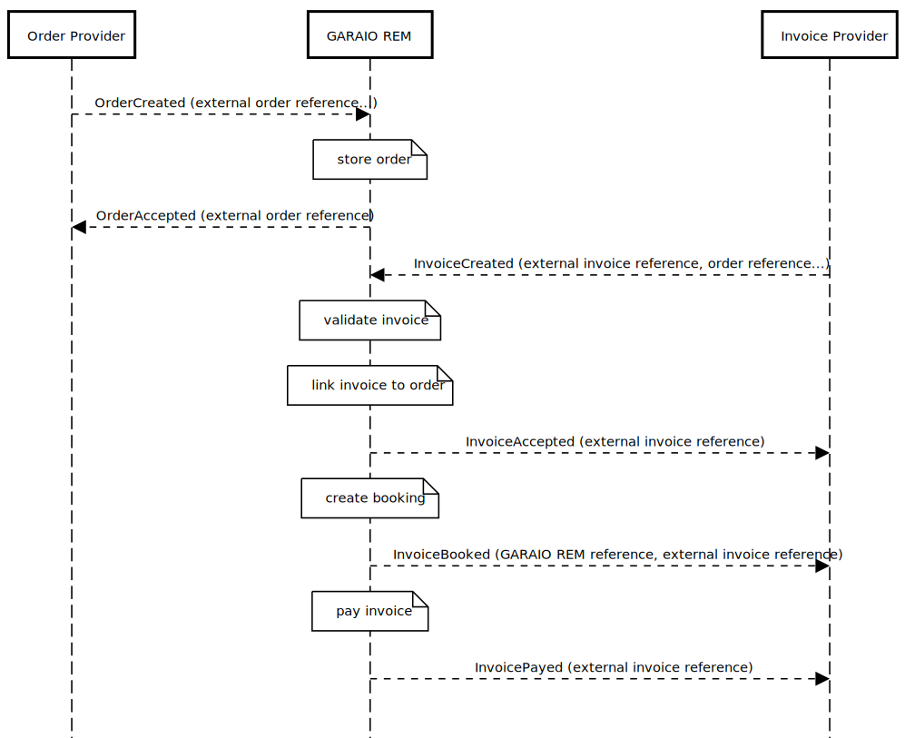

# Orders and Invoicing Context

## Events

Type | GARAIO REM | REM | Description
---|---|---|---
[Invoicing.Order.Created](#invoicingordercreated) | :white_check_mark: | :x: | An order has been created
[Invoicing.Order.Accepted](#invoicingorderaccepted) | :white_check_mark: | :x: | An order has been accepted by GARAIO REM
[Invoicing.Order.Rejected](#invoicingorderrejected) | :white_check_mark: | :x: | An order has been rejected by GARAIO REM
[Invoicing.Order.Updated](#invoicingorderupdated) | :white_check_mark: | :x: | An already published order has been updated
[Invoicing.Order.Deleted](#invoicingorderdeleted) | :white_check_mark: | :x: | An order created by a third party system has been deleted
[Invoicing.Invoice.Created](#invoicinginvoicecreated) | :white_check_mark: | :x: | An invoice has been created
[Invoicing.Invoice.Accepted](#invoicinginvoiceaccepted) | :white_check_mark: | :x: | An invoice has been accepted by GARAIO REM
[Invoicing.Invoice.Rejected](#invoicinginvoicerejected) | :white_check_mark: | :x: | An invoice has been rejected by GARAIO REM
[Invoicing.Invoice.Deleted](#invoicinginvoicedeleted) | :white_check_mark: | :x: | An incomplete invoice has been deleted in GARAIO REM
[Invoicing.Invoice.Booked](#invoicinginvoicebooked) | :white_check_mark: | :x: | An invoice was booked in GARAIO REM
[Invoicing.Invoice.Cancelled](#invoicinginvoicecancelled) | :white_check_mark: | :x: | An invoice has been cancelled in GARAIO REM (Storno)
[Invoicing.Invoice.Payed](#invoicinginvoicepayed) | :white_check_mark: | :x: | An invoice has been payed by GARAIO REM

### Invoicing.Order.Created

This message goes from the order provider to GARAIO REM. Set the recipient property in the headers, eg `"grem_derham"`. All attributes are optional unless noted otherwise in the remarks

| Field                                      | Type      | Content / Remarks                                                                                                                                                              |
| ------------------------------------------ | --------- | ------------------------------------------------------------------------------------------------------------------------------------------------------------------------------ |
| `eventType`                                | `string`  | `Invoicing.Order.Created`                                                                                                                                                      |
| `data`                                     | `hash`    |                                                                                                                                                                                |
| &nbsp;&nbsp;`externalReference`            | `string`  | external identifier / document number from the order provider; **required**                                                                                                    |
| &nbsp;&nbsp;`reference`                    | `longint` | **For direct use by customers only**. Use with caution and read notes first. Overrides generated GREM reference. (1)                                                           |
| &nbsp;&nbsp;`supplierReference`            | `string`  | reference of the supplier (creditor); **required**                                                                                                                             |
| &nbsp;&nbsp;`masterdataReference`          | `string`  | reference of a property / building / unit; **required**                                                                                                                        |
| &nbsp;&nbsp;`tenancyAgreementReference`    | `string`  | reference of a tenancy agreement, eg '1234.01.0001.01'                                                                                                                         |
| &nbsp;&nbsp;`subject`                      | `string`  | Short description of the order                                                                                                                                                 |
| &nbsp;&nbsp;`description`                  | `string`  | Description of the order                                                                                                                                                       |
| &nbsp;&nbsp;`deliveryInfo`                 | `string`  | Free text for the delivery info, eg end of may                                                                                                                                 |
| &nbsp;&nbsp;`discount`                     | `decimal` | discount (percentage) the supplier is offering for the order                                                                                                                   |
| &nbsp;&nbsp;`discountDays`                 | `integer` | number of days for the discount                                                                                                                                                |
| &nbsp;&nbsp;`offeringDate`                 | `string`  | ISO 8601 encoded date, eg `'2020-10-21'`                                                                                                                                       |
| &nbsp;&nbsp;`contactAddress`               | `string`  | Address lines of the contact person, separated by CRLF                                                                                                                         |
| &nbsp;&nbsp;`deliveryAddress`              | `string`  | Address lines for the delivery, separated by CRLF                                                                                                                              |
| &nbsp;&nbsp;`reimbursementNote`            | `string`  | Note of reimbursement (Weiterverrechnungsvermerk)                                                                                                                              |
| &nbsp;&nbsp;`typeCode`                     | `string`  | Code value for type of order (see code table `kreditorenauftrag_typ`)                                                                                                          |
| &nbsp;&nbsp;`languageCode`                 | `string`  | `de`, `fr`, `it` or `en`; will be used to send error reasons using the desired language; **must be lower case**                                                                |
| &nbsp;&nbsp;`backlinkUrl`                  | `string`  | optional url to navigate to the order on the sending system; **must be a complete url that the local browser can resolve (including protocol), e.g. <https://www.google.com>** |
| &nbsp;&nbsp;`clerkUsername`                | `string`  | Username of clerk (Sachbearbeiter) to assign.                                                                                                                                  |
| &nbsp;&nbsp;`orderItems`                   | `array`   | List of order items; may be empty                                                                                                                                              |
| &nbsp;&nbsp;&nbsp;&nbsp;`itemNumber`       | `integer` | invoice item number to preserve order; **required**                                                                                                                            |
| &nbsp;&nbsp;&nbsp;&nbsp;`accountNumber`    | `string`  | accounting account number, eg "10122"; must be valid for the accounting that belongs to the `masterdataReference`  **required**                                                |
| &nbsp;&nbsp;&nbsp;&nbsp;`costCenterNumber` | `string`  | cost center number; optional / required depending on the accountNumber                                                                                                         |
| &nbsp;&nbsp;&nbsp;&nbsp;`taxCode`          | `string`  | tax code known to GARAIO REM, eg 'NO'; optional / required depending on the accountNumber                                                                                      |
| &nbsp;&nbsp;&nbsp;&nbsp;`bookingAmount`    | `decimal` | amount to book (including taxes, if appropriate)                                                                                                                               |
| &nbsp;&nbsp;&nbsp;&nbsp;`bookingText`      | `string`  | optional booking text                                                                                                                                                          |
| &nbsp;&nbsp;&nbsp;&nbsp;`amount`           | `decimal` | Quantity - optional / required depending on the accountNumber, eg. number of windows                                                                                           |

Notes

* (1) See [about reference and externalReference](#about-reference-and-externalreference-in-the-context-of-invoicing).

#### Example

```json
{"eventType":"Invoicing.Order.Created",
  "data":{
    "externalReference":"1234",
    "supplierReference":"5555",
    "subject":"this is the subject",
    "description":"this is the description",
    "deliveryInfo":"end of may",
    "masterdataReference":"4712.01.0001",
    "discount":"5.00",
    "discountDays":"10",
    "offeringDate":"2020-10-13",
    "contactAddress": "Garaio AG\r\nLaupenstrasse 45\r\n3001 Bern",
    "deliveryAddress": "Garaio AG\r\nLaupenstrasse 45\r\n3001 Bern",
    "languageCode":"fr",
    "backlinkUrl":"https://instance.external_system.ch/order/3",
    "clerkUsername": "clerk",
    "orderItems":[
      {"lineNumber":1,
       "accountNumber":"100001",
       "costCenterNumber":"700",
       "taxCode":"00",
       "bookingAmount":1200.50,
       "bookingText":"this goes into the booking movement",
       "amount":100.00,
      }
    ]
  }
}
```

### Invoicing.Order.Accepted

This message goes from GARAIO REM to the order provider and signals that GARAIO REM has stored the order

| Field                           | Type      | Content / Remarks                           |
| ------------------------------- | --------- | ------------------------------------------- |
| `eventType`                     | `string`  | Invoicing.Order.Accepted                    |
| `data`                          | `hash`    |                                             |
| &nbsp;&nbsp;`reference`         | `longint` | unique identifier of the order              |
| &nbsp;&nbsp;`externalReference` | `string`  | external identifier from the order provider |

#### Example

```json
{"eventType":"Invoicing.Order.Accepted",
  "data":{
    "reference":1234,
    "externalReference":"54820394-001",
  }
}
```

### Invoicing.Order.Rejected

This message goes from GARAIO REM to the order provider and signals that GARAIO REM did not accept the order. GARAIO REM validation errors are mapped into the reasons array

| Field                               | Type     | Content / Remarks                                     |
| ----------------------------------- | -------- | ----------------------------------------------------- |
| `eventType`                         | `string` | Invoicing.Order.Rejected                              |
| `data`                              | `hash`   |                                                       |
| &nbsp;&nbsp;`externalReference`     | `string` | external identifier from the order provider           |
| &nbsp;&nbsp;`reference`             | `string` | unique identifier for the order                       |
| &nbsp;&nbsp;`reasons`               | `array`  |                                                       |
| &nbsp;&nbsp;&nbsp;&nbsp;`attribute` | `string` | name of the attribute, eg. "masterdataReference"; (1) |
| &nbsp;&nbsp;&nbsp;&nbsp;`reason`    | `string` | reason, eg. "ist nicht bekannt"                       |

Notes

* (1) might be null if the reason does not map to a specific attribute

#### Example

```json
{"eventType":"Invoicing.Order.Rejected",
  "data":{
    "reference":null,
    "externalReference":"1234",
    "reasons":[
      {"attribute":"masterdataReference",
       "reason":"ist nicht bekannt"
      }
    ]
  }
}
```

### Invoicing.Order.Updated

This message goes from the order provider to GARAIO REM. Set the recipient property in the headers, eg `"grem_derham"`. All attributes are optional unless noted otherwise in the remarks.
This message completely replaces an existing order in GARAIO REM; if you pass, for example, only one orderItem for an order that has two order items, the order will have one orderItem after the update

| Field                                      | Type      | Content / Remarks                                                                                                                                                              |
| ------------------------------------------ | --------- | ------------------------------------------------------------------------------------------------------------------------------------------------------------------------------ |
| `eventType`                                | `string`  | `Invoicing.Order.Updated`                                                                                                                                                      |
| `data`                                     | `hash`    |                                                                                                                                                                                |
| &nbsp;&nbsp;`reference`                    | `string`  | unique identifier; maybe required, see (1)                                                                                                                                     |
| &nbsp;&nbsp;`externalReference`            | `string`  | external identifier from the order provider;  maybe required, see (1)                                                                                                          |
| &nbsp;&nbsp;`supplierReference`            | `string`  | reference of the supplier (creditor); **required**                                                                                                                             |
| &nbsp;&nbsp;`masterdataReference`          | `string`  | reference of a property / building / unit; **required**                                                                                                                        |
| &nbsp;&nbsp;`tenancyAgreementReference`    | `string`  | reference of a tenancy agreement, eg '1234.01.0001.01'                                                                                                                         |
| &nbsp;&nbsp;`subject`                      | `string`  | Short description of the order                                                                                                                                                 |
| &nbsp;&nbsp;`description`                  | `string`  | Description of the order                                                                                                                                                       |
| &nbsp;&nbsp;`deliveryInfo`                 | `string`  | Free text for the delivery info, eg end of may                                                                                                                                 |
| &nbsp;&nbsp;`discount`                     | `decimal` | discount (percentage) the supplier is offering for the order                                                                                                                   |
| &nbsp;&nbsp;`discountDays`                 | `integer` | number of days for the discount                                                                                                                                                |
| &nbsp;&nbsp;`offeringDate`                 | `string`  | ISO 8601 encoded date, eg `'2020-10-21'`                                                                                                                                       |
| &nbsp;&nbsp;`contactAddress`               | `string`  | Address lines of the contact person, separated by CRLF                                                                                                                         |
| &nbsp;&nbsp;`deliveryAddress`              | `string`  | Address lines for the delivery, separated by CRLF                                                                                                                              |
| &nbsp;&nbsp;`reimbursementNote`            | `string`  | Note of reimbursement (Weiterverrechnungsvermerk)                                                                                                                              |
| &nbsp;&nbsp;`typeCode`                     | `string`  | Code value for type of order (see code table `kreditorenauftrag_typ`)                                                                                                          |
| &nbsp;&nbsp;`languageCode`                 | `string`  | `de`, `fr`, `it` or `en`; determines error reasons language; **must be lower case**                                                                                            |
| &nbsp;&nbsp;`backlinkUrl`                  | `string`  | optional url to navigate to the order on the sending system; **must be a complete url that the local browser can resolve (including protocol), e.g. <https://www.google.com>** |
| &nbsp;&nbsp;`clerkUsername`                | `string`  | Username of clerk (Sachbearbeiter) to assign.                                                                                                                                  |
| &nbsp;&nbsp;`orderItems`                   | `array`   | List of order items; may be empty; orderItems that exists in the order but are not passed here will be deleted                                                                 |
| &nbsp;&nbsp;&nbsp;&nbsp;`itemNumber`       | `integer` | invoice item number to preserve order; **required**                                                                                                                            |
| &nbsp;&nbsp;&nbsp;&nbsp;`accountNumber`    | `string`  | accounting account number, eg "10122"; must be valid for the accounting that belongs to the `masterdataReference`  **required**                                                |
| &nbsp;&nbsp;&nbsp;&nbsp;`costCenterNumber` | `string`  | cost center number; optional / required depending on the accountNumber                                                                                                         |
| &nbsp;&nbsp;&nbsp;&nbsp;`taxCode`          | `string`  | tax code known to GARAIO REM, eg 'NO'; optional / required depending on the accountNumber                                                                                      |
| &nbsp;&nbsp;&nbsp;&nbsp;`bookingAmount`    | `decimal` | amount to book (including taxes, if appropriate)                                                                                                                               |
| &nbsp;&nbsp;&nbsp;&nbsp;`bookingText`      | `string`  | optional booking text                                                                                                                                                          |
| &nbsp;&nbsp;&nbsp;&nbsp;`amount`           | `decimal` | Quantity - optional / required depending on the accountNumber, eg. number of windows                                                                                           |

Notes:

* (1) You have to provide either `reference` or `externalReference`. The reference you provide must be a reference that has previously beem published in a `Invoicing.Order.Created` message.

#### Example

```json
{
  "eventType":"Invoicing.Order.Updated",
  "data":{
    "externalReference":"1234",
    "supplierReference":"100010",
    "masterdataReference":"10001.152.132",
    "subject":"Das ist ein Auftrag",
    "description":"und das ist die <b>Beschreibung</b> des Auftrags",
    "deliveryInfo":"end of may",
    "discount":"5.00",
    "discountDays":"10",
    "offeringDate":"2020-11-03",
    "contactAddress":"Garaio AG\\nLaupenstrasse 45\\n3001 Bern",
    "deliveryAddress":"Garaio AG\\nLaupenstrasse 45\\n3001 Bern",
    "languageCode":"fr",
    "clerkUsername":"Testuser_5",
    "orderItems":[
      {
        "lineNumber":1,
        "accountNumber":"400000",
        "costCenterNumber":"600",
        "bookingAmount":100,
        "amount":10,
        "taxCode":"00",
        "bookingText":"Regler defekt bei Heizkörper"
      }
    ]
  }
}
```

#### Responses

You will get back either a [Invoicing.Order.Accepted](#invoicingorderaccepted) or a [Invoicing.Order.Rejected](#invoicingorderrejected).

### Invoicing.Order.Deleted

This message goes from the order provider to GARAIO REM. Set the recipient property in the headers, eg "grem_derham". GARAIO REM will the delete the referenced order, unless it is already connected to an invoice.

| Field                           | Type     | Content / Remarks                                                                 |
| ------------------------------- | -------- | --------------------------------------------------------------------------------- |
| `eventType`                     | `string` | Invoicing.Order.Deleted                                                           |
| `data`                          | `hash`   |                                                                                   |
| &nbsp;&nbsp;`reference`         | `string` | unique identifier for the order; maybe required, see (1)                           |
| &nbsp;&nbsp;`externalReference` | `string` | external order identifier from the order provider; maybe required, see (1) |

Notes

* (1) You have to provide either a `reference` or an `externalReference`.

#### Example

```json
{"eventType":"Invoicing.Order.Deleted",
  "data":{
    "externalReference":"54820394-001",
  }
}
```

#### Invoicing.Order.DeletedAccepted

The [Accept](./result_messages.md#accepted-message) message.

Additional `data` fields:

| Field               | Type      | Content / Remarks               |
| ------------------- | --------- | ------------------------------- |
| `reference`         | `longint` | unique identifier for the order |
| `externalReference` | `string`  | external reference              |

#### Invoicing.Order.DeletedRejected

The [Reject](./result_messages.md#rejected-message) message.

| Field               | Type      | Content / Remarks               |
| ------------------- | --------- | ------------------------------- |
| `reference`         | `longint` | unique identifier for the order |
| `externalReference` | `string`  | external reference              |

### Invoicing.Invoice.Created

This message goes from the invoice provider to GARAIO REM. Set  the recipient property in the headers, eg "grem_derham". Depending on the GARAIO REM configuration (AVK strict mode or relaxed mode), invoiceItems are mandatory or not.

| Field                                                   | Type      | Content / Remarks                                                                                                                                               |
| ------------------------------------------------------- | --------- | --------------------------------------------------------------------------------------------------------------------------------------------------------------- |
| `eventType`                                             | `string`  | Invoicing.Invoice.Created                                                                                                                                       |
| `data`                                                  | `hash`    |                                                                                                                                                                 |
| &nbsp;&nbsp;`externalReference`                         | `string`  | external identifier from the invoice provider; **required**                                                                                              |
| &nbsp;&nbsp;`reference`                                 | `longint` | **For direct use by customers only**. Use with caution and read notes first. Overrides generated GREM reference. (1)                                            |
| &nbsp;&nbsp;`orderReference`                            | `longint` | optional reference of the associated order; must be an order reference generated by GARAIO REM; leave it empty if you pass an externalOrderReference            |
| &nbsp;&nbsp;`externalOrderReference`                    | `string`  | optional external reference of the associated order generated by the orders provider                                                                            |
| &nbsp;&nbsp;`preaccountingReference`                    | `string`  | optional preaccounting reference (max 255 characters)                                                                                                           |
| &nbsp;&nbsp;`creditorReference`                         | `string`  | reference of the creditor (supplier); **required**                                                                                                              |
| &nbsp;&nbsp;`accountingReference`                       | `string`  | reference of the accounting; **required**                                                                                                                       |
| &nbsp;&nbsp;`swissQrCode`                               | `hash`    | swissQrCode; **optional** (2)                                                                                                                                   |
| &nbsp;&nbsp;`iban`                                      | `string`  | ESR Payments are deprecated, use `swissQrCode` instead. iban for the payment (optional); (3)                                                                    |
| &nbsp;&nbsp;`esrReference`                              | `string`  | ESR Payments are deprecated, use `swissQrCode` instead. reference number on the payment slip. (6)                                                               |
| &nbsp;&nbsp;`esrParticipantNumber`                      | `string`  | ESR Payments are deprecated, use `swissQrCode` instead. pass this number together with the esrReference if you don't have an iban or swissQrCodeText            |
| &nbsp;&nbsp;`languageCode`                              | `string`  | de, fr, it or en; **required** to send error reasons using the desired language; **must be lower case**                                                         |
| &nbsp;&nbsp;`notes`                                     | `string`  | ESR Payments are deprecated, use `swissQrCode` instead. up to four lines of text at up to 28 chars per line, separated by CRLF (optional)                       |
| &nbsp;&nbsp;`documentUrl`                               | `string`  | url to the invoice pdf; **must be an url to a pdf that the local browser can resolve**                                                                          |
| &nbsp;&nbsp;`totalGrossAmount`                          | `decimal` | ESR Payments are deprecated, use `swissQrCode` instead. total gross amount of the invoice; **required if no invoiceItems are supplied**, must be greater than 0 |
| &nbsp;&nbsp;`externalUserName`                          | `string`  | optional name of the user that completed the invoice in the external process                                                                                    |
| &nbsp;&nbsp;`dmsReference`                              | `string`  | optional reference of the DMS document                                                                                                                          |
| &nbsp;&nbsp;`invoiceDate`                               | `string`  | ISO 8601 encoded date, eg '2020-10-21'; **required**                                                                                                            |
| &nbsp;&nbsp;`dueDate`                                   | `string`  | ISO 8601 encoded date, eg '2020-10-21'; optional, defaults to today                                                                                             |
| &nbsp;&nbsp;`bookingDate`                               | `string`  | ISO 8601 encoded date, eg '2020-10-21'; optional, defaults to today                                                                                             |
| &nbsp;&nbsp;`transitoryDeferralPeriod`                  | `string`  | optional, ISO 8601 Time-Interval with restrictions, see (4); **NOTE: this field may NOT be used with 'transitoryDeferralDates' within 'invoiceItems'**          |
| &nbsp;&nbsp;`invoiceItems`                              | `array`   | if AVK is configured for strict mode, at least one item is required; if strict mode is disabled, you may pass an empty array, null or omit the attribute        |
| &nbsp;&nbsp;&nbsp;&nbsp;`itemNumber`                    | `integer` | invoice item number to preserve order; **required**                                                                                                             |
| &nbsp;&nbsp;&nbsp;&nbsp;`accountNumber`                 | `string`  | accounting account number, prefixed by the accounting reference, eg "6056.10122"; **required**                                                                  |
| &nbsp;&nbsp;&nbsp;&nbsp;`costCenterNumber`              | `string`  | cost center number; optional / required depending on the accountNumber                                                                                          |
| &nbsp;&nbsp;&nbsp;&nbsp;`taxCode`                       | `string`  | tax code known to GARAIO REM, eg 'NO'; optional / required depending on the accountNumber                                                                       |
| &nbsp;&nbsp;&nbsp;&nbsp;`bookingAmount`                 | `decimal` | amount to book (including taxes, if appropriate); **required**                                                                                                  |
| &nbsp;&nbsp;&nbsp;&nbsp;`bookingText`                   | `string`  | optional booking text                                                                                                                                           |
| &nbsp;&nbsp;&nbsp;&nbsp;`masterdataReference`           | `string`  | optional reference of a property / building / unit; might be required depending on the accountNumber                                                            |
| &nbsp;&nbsp;&nbsp;&nbsp;`additionalCostsDate`           | `string`  | ISO 8601 encoded date, eg '2021-06-30' (NK-Periodedatum); optional or required depending on the accountNumber                                                   |
| &nbsp;&nbsp;&nbsp;&nbsp;`valueDate`                     | `string`  | ISO 8601 encoded date, eg '2020-10-21' (Valuta); optional, defaults to the `invoiceDate`                                                                        |
| &nbsp;&nbsp;&nbsp;&nbsp;`amount`                        | `decimal` | Quantity - optional / required depending on the accountNumber, eg. litres of oil                                                                                |
| &nbsp;&nbsp;&nbsp;&nbsp;`transitoryDeferralDate`        | `string`  | optional ISO 8601 encoded date, eg '2020-10-21', optional (transitorisches Abgrenzungsdatum)                                                                    |
| &nbsp;&nbsp;&nbsp;&nbsp;`maintenanceLogText`            | `string`  | optional uses bookingText if empty                                                                                                                              |
| &nbsp;&nbsp;&nbsp;&nbsp;`developmentCode`               | `string`  | optional development code retrieved from a GraphQL query (codeTable developments); sometimes required see (5)                                                   |
| &nbsp;&nbsp;&nbsp;&nbsp;`developmentAccountingPlanCode` | `string`  | optional development accounting plan code retrieved from a GraphQL query (codeTable developmentAccountingPlans); sometimes required see (5)                     |

Notes

* (1) See [about reference and externalReference](#about-reference-and-externalreference-in-the-context-of-invoicing).
* (2) When 'swissQrCode' is used, then the following top-level fields MUST be empty or omitted: 'iban', 'esrReference', 'esrParticipantNumber', 'totalGrossAmount' and 'notes') See the [SwissQRCode Section](#minimal-swiss-qr-code-when-creating-an-invoice) at the end of this page to understand Garaio REM Invoicing with SwissQrCodes.
* (3) Always pass the iban or swissQrCodeText, if you pass the iban field esr attributes and swissQrCodeText must be empty or omitted.
* (4) We only support the start/end format using ISO 8601 encoded dates (no time inclusion is supported) using the separator '/' or '--', eg '2020-01-31/2020-06-30' or '2020-01-31--2020-06-30' (<https://en.wikipedia.org/wiki/ISO_8601#Time_intervals>)
* (5) If you apply a development code, a development accounting plan code is required as well
* (6) Pass this number together with the esrParticipantNumber if you don't have an iban or swissQrCodeText.

#### Example of a complete invoice with IBAN

```json
{"eventType":"Invoicing.Invoice.Created",
  "data":{
    "externalReference":"1234",
    "externalOrderReference":"5678",
    "creditorReference":"5555",
    "accountingReference":"4711",
    "iban":"CH0209000000100013997",
    "languageCode":"fr",
    "notes":"line 1\r\nline 2\r\nline 3\r\nline 4",
    "documentUrl":"https://path/to/the/scan.pdf",
    "totalGrossAmount":1200.50,
    "externalUserName":"External User",
    "dmsReference":"5678",
    "invoiceDate":"2020-10-21",
    "dueDate":"2020-11-21",
    "bookingDate":"2020-10-21",
    "invoiceItems":[
      {"lineNumber":1,
       "accountNumber":"4712.100001",
       "costCenterNumber":"700",
       "taxCode":"00",
       "bookingAmount":1200.50,
       "bookingText":"this goes into the booking movement",
       "masterdataReference":"4712.01",
       "additionalCostsDate":"2021-06-30",
       "valueDate":"2020-10-21",
       "amount":100.00,
       "transitoryDeferralDate":"2020-12-31",
       "maintenanceLogText":"kitchen sink replaced",
       "developmentCode":"001",
       "developmentAccountingPlanCode":"100"
      }
    ]
  }
}
```

#### Example of a minimal invoice (relaxed mode)

```json
{"eventType":"Invoicing.Invoice.Created",
  "data":{
    "externalReference":"1234",
    "creditorReference":"5555",
    "accountingReference":"4711",
    "totalGrossAmount":1200.50,
    "invoiceDate":"2020-10-21"
  }
}
```

### Invoicing.Invoice.Accepted

This message goes from GARAIO REM to the invoice provider and signals that GARAIO REM has stored and booked the invoice

| Field                           | Type      | Content / Remarks                             |
| ------------------------------- | --------- | --------------------------------------------- |
| `eventType`                     | `string`  | Invoicing.Invoice.Accepted                    |
| `data`                          | `hash`    |                                               |
| &nbsp;&nbsp;`reference`         | `longint` | unique identifier of the invoice              |
| &nbsp;&nbsp;`externalReference` | `string`  | external identifier from the invoice provider |

Example

```json
{"eventType":"Invoicing.Invoice.Accepted",
  "data":{
    "reference":1234,
    "externalReference":"54820394-001",
  }
}
```

### Invoicing.Invoice.Rejected

This message goes from GARAIO REM to the invoice provider and signals that GARAIO REM did not accept the invoice. GARAIO REM validation errors are mapped into the reasons array

| Field                                | Type      | Content / Remarks                                                        |
| ------------------------------------ | --------- | ------------------------------------------------------------------------ |
| `eventType`                          | `string`  | Invoicing.Invoice.Rejected                                               |
| `data`                               | `hash`    |                                                                          |
| &nbsp;&nbsp;`externalReference`      | `string`  | external identifier from the invoice provider                            |
| &nbsp;&nbsp;`reference`              | `string`  | unique invoice identifier                                                |
| &nbsp;&nbsp;`reasons`                | `array`   |                                                                          |
| &nbsp;&nbsp;&nbsp;&nbsp;`attribute`  | `string`  | name of the attribute, eg. "accountingReference"; (1)                    |
| &nbsp;&nbsp;&nbsp;&nbsp;`lineNumber` | `integer` | Invoice line number if the problem is on an invoice line or null, if not |
| &nbsp;&nbsp;&nbsp;&nbsp;`reason`     | `string`  | reason, eg. "ist nicht bekannt"                                          |

Notes

* (1) Might be null if the reason does not map to a specific attribute.

#### Example

```json
{"eventType":"Invoicing.Invoice.Rejected",
  "data":{
    "reference":null,
    "externalReference":"1234",
    "reasons":[
      {"attribute":"accountingReference",
       "lineNumber":null,
       "reason":"ist nicht bekannt"
      }
    ]
  }
}
```

### Invoicing.Invoice.Deleted

This message goes from GARAIO REM to the invoice provider and signals that a user has deleted the incomplete (not yet booked) invoice in GARAIO REM

| Field                           | Type     | Content / Remarks                             |
| ------------------------------- | -------- | --------------------------------------------- |
| `eventType`                     | `string` | Invoicing.Invoice.Deleted                     |
| `data`                          | `hash`   |                                               |
| &nbsp;&nbsp;`reference`         | `string` | unique invoice identifier                     |
| &nbsp;&nbsp;`externalReference` | `string` | external identifier from the invoice provider |

#### Example

```json
{"eventType":"Invoicing.Invoice.Deleted",
  "data":{
    "reference": 1234,
    "externalReference":"54820394-001",
  }
}
```

### Invoicing.Invoice.Booked

This message goes from GARAIO REM to the invoice provider and signals that GARAIO REM has booked the invoice. This may happen immediately after receiving a Invoicing.Invoice.Created message (if the invoice data is valid and complete) or it may happen after a user has completed an incomplete invoice.
This message goes from GARAIO REM to the invoice provider and signals that GARAIO REM has booked the invoice. This may happen immediately after receiving a Invoicing.Invoice.Created message (if the invoice data is valid and complete) or it may happen after a user has completed an incomplete invoice.

In any case, this message follows a Invoicing.Invoice.Accepted message, immediately or later (in case of an invoice that needs user interaction)

Field | Type | Content / Remarks
---|---|---
`eventType` | `string` | Invoicing.Invoice.Booked
`data` | `hash` |
&nbsp;&nbsp;`reference` | `longint` | unique identifier for the invoice, generated by GARAIO REM
&nbsp;&nbsp;`externalReference` | `string` | external identifier from the invoice provider

#### Example

```json
{"eventType":"Invoicing.Invoice.Booked",
  "data":{
    "reference":1234,
    "externalReference":"54820394-001",
  }
}
```

### Invoicing.Invoice.Cancelled

This message goes from GARAIO REM to the invoice provider and signals that a user has cancelled the booked invoice in GARAIO REM (Storno)

Field | Type | Content / Remarks
---|---|---
`eventType` | `string` | Invoicing.Invoice.Cancelled
`data` | `hash` |
&nbsp;&nbsp;`reference` | `longint` | unique identifier for the invoice, generated by GARAIO REM
&nbsp;&nbsp;`externalReference` | `string` | external identifier from the invoice provider

#### Example

```json
{"eventType":"Invoicing.Invoice.Cancelled",
  "data":{
    "reference":1234,
    "externalReference":"54820394-001",
  }
}
```

### Invoicing.Invoice.Payed

This message goes from GARAIO REM to the invoice provider and signals that GARAIO REM has payed the invoice

Field | Type | Content / Remarks
---|---|---
`eventType` | `string` | Invoicing.Invoice.Payed
`data` | `hash` |
&nbsp;&nbsp;`reference` | `longint` | unique identifier for the invoice, generated by GARAIO REM
&nbsp;&nbsp;`externalReference` | `string` | external identifier from the invoice provider
&nbsp;&nbsp;`paymentDate` | `date` | Date when the payment was triggered in GARAIO REM

#### Example

```json
{"eventType":"Invoicing.Invoice.Payed",
  "data":{
    "reference":1234,
    "externalReference":"54820394-001",
    "paymentDate":"2021-03-10"
  }
}
```

## Message Flows

### Invoice submission happy path

GARAIO REM receives an invoice that passes all validations, stores the invoice, creates the booking and sends the `InvoiceAccepted` message back to the invoice provider with the external invoice reference



### Invoice validation errors

GARAIO REM receives an invoice that does not pass the validations, does NOT store the invoice and sends the `InvoiceRejected` message back to the invoice provider with the external invoice reference and the reasons (validation errors)



### Incomplete invoice

GARAIO REM receives an incomplete invoice that passes the basic validations but is not complete, stores the invoice, does NOT create the booking and sends the InvoiceAccepted message back to the invoice provider with the external invoice reference

Later, a user completes the invoice, GARAIO REM creates the booking and sends the `InvoiceBooked` message back to the invoice provider with the internal GARAIO REM reference and the external invoice reference



### Invoice deleted

GARAIO REM receives an invoice that passes the basic validations but needs completion, stores the invoice and sends the InvoiceAccepted message back to the invoice provider with the external invoice reference

Later, a user deletes the invoice and GARAIO REM sends the `InvoiceDeleted` message back to the invoice provider with the external invoice reference



### Invoice cancelled

GARAIO REM receives an invoice that passes the validations, stores the invoice, creates the booking and sends the `InvoiceAccepted` message back to the invoice provider with the external invoice reference

Later, a user cancels the invoice and GARAIO REM sends the `InvoiceCancelled` message back to the invoice provider with the external invoice reference



### Invoice payed

GARAIO REM receives an invoice that passes the validations, stores the invoice, creates the booking and sends the `InvoiceAccepted` message back to the invoice provider with the external invoice reference

Later, GARAIO REM pays the invoice and GARAIO REM sends the `InvoicePayed` message back to the invoice provider with the external invoice reference



### Order and invoice message flow with incomplete invoices

GARAIO REM receives an order and stores the order.

Later, The invoice provider finds the order through a GraphQL query and sends an `InvoiceCreated` message to GARAIO REM including the order number. GARAIO REM validates the invoice data, stores the invoice, links it to the order and sends an `InvoiceAccepted` message to the invoice provider.

Later, a user completes the invoice in GARAIO REM and the invoice is booked.

Later, GARAIO REM pays the invoice and GARAIO REM sends the `InvoicePayed` message back to the invoice provider with the external invoice reference



### Minimal Swiss QR Code when creating an Invoice

This documentation describes the minimum data Garaio REM needs to process an incoming Swiss QR Code.  We do not require all the information for a valid Swiss QR Code, however, what we do accept, MUST be conform with the Swiss QR Code Specification v2.2 - for your convenience we have copied this specification here: [SwissQR Code Specification v2.2](relevant_pdfs/ig-qr-bill-en.pdf).

Unlike the SwissQRCode Specification, we do not require: `header-qrType`, `header-version`, `header-coding`, `payment-currency` or the "creditor" _(name and address information)_.

Attributes we currently process when using a Swiss QR Code to create an invoice:

GaraioREM SwissQR Key | SwissQRCode Group Key | SwissQRCode Input Key  |  | Garaio REM Data Type | Description
---|---|---|---|---|---
swissQrCode { | | | | `hash` | swissQrCode; **optional** |
&nbsp; | cdtrInf { | | | `hash` | Creditor Account Information; **required data group**
&nbsp; | &nbsp; | iban | | `string`  | fixed length:21 alphanumeric characters ('CH' or 'LI' must start SwissQRCodes; QR-IBANs must have the ESR-Reference-Type (rmtInf.tp) of 'QRR'); **required**
&nbsp; | } | |  |
&nbsp; | ccyAmt { | | | `hash` | Payment Information; **required data group**
&nbsp; | &nbsp; | amt | | `decimal` | Payment Amount (maximum 12 characters allowed, including the `decimal` point); **required**
&nbsp; | &nbsp; | ccy |  |`string` | Currency (we only accept 'CHF' for processing); **Optional**
&nbsp; | rmtInf { | | | `hash` | Payment Reference Information; **required data group**
&nbsp; | &nbsp; | tp | | `string` | Reference Type (valid options are: QRR (QR-Reference), SCOR (Swiss Creditor-Reference ISO 11649), NON (no reference) - this is used to validate that the IBAN and ESR-Reference are valid compared to the QR Type); **required**
&nbsp; | &nbsp; | ref | | `string` | Reference string; **required for QRR or SCOR types**
&nbsp; | &nbsp; | addInf { | | `hash` | Additional Information; **optional data group**
&nbsp; | &nbsp; |  &nbsp; | ustrd | `string` | Processing Message; **Optional**
&nbsp; | &nbsp; |  } | | |
&nbsp; | } | |  | |
} | | |  | |

**NOTE:**

* When `payment-currency` is given we validate that it is ONLY `'CHF'`
* When `header-qrType`, `header-version`, `header-coding` is given it will be validated to against the SwissQRCode Specification Version `0200`

Sample Invoice Data to be created when minimal Swiss QR Code values are given:

```json
{"eventType":"Invoicing.Invoice.Created",
  "data":{
    "externalReference":"1234",
    "creditorReference":"100010",
    "accountingReference":"1",
    "invoiceDate":"2020-10-21",
    "dueDate":"2020-11-21",
    "bookingDate":"2020-10-21",
    "languageCode":"de",
    "documentUrl":"https://path/to/the/scan.pdf",
    "invoiceItems":[
      { "lineNumber":1,
        "accountNumber":"1.400000",
        "bookingAmount":1200.5,
        "bookingText":"this goes into the booking movement"
      }
    ],
    "swissQrCode":{
      "cdtrInf":{
        "iban":"CH4431999123000889012"
      },
      "ccyAmt":{
        "amt":"1200.50"
      },
      "rmtInf":{
        "tp":"QRR",
        "ref":"210000000003139471430009017",
        "addInf":{
          "ustrd": "Optional Payment Info"
        }
      }
    }
  }
}
```

NOTE: the original SwissQR Code Standards can be found at: <https://www.paymentstandards.ch/dam/downloads/ig-qr-bill-en.pdf>

## About reference and externalReference in the context of Invoicing.*

While a `reference` is unique, an `externalReference` does not have to be. This has some implications for tracking state change notifications in later messages, e.g. being able to map a `Invoicing.Invoice.Booked` to the correct preceding `Invoicing.Invoice.Created`.

The intended use of the field `externalReference` is for the supplier document reference. As two suppliers might both send you an Invoice with reference "1", you can end up with duplicate `externalReference`s.

You have the following options to track state change notifications:

* (Recommended) When tracking responses (`Accepted` and `Rejected` messages), use the correlation id (see [result messages](/result_messages.md)).
* (Recommended) To track state changes (e.g. `Invoicing.Order.Deleted` or `Invoicing.Invoice.Booked`), use the `reference`.  When creating an `Invoice` or `Order`, keep of track the returned `reference`. Look at the `reference` field of subsequent messages to identify their subject.
* As an alternative for state change tracking, you can choose to set unique `externalReference`s and compare these with the `externalReference` field of subsequent messages. It is your responsability to make sure `externalReference` is unique (remember your users might be allowed to set these manually in GREM).
* **Only for customers, don't write partner services that integrate this way**: You can choose to set `reference` yourself when creating. This makes sense if you have an upstream system that coordinates document reference assignment. `reference` will override the reference generated by GREM by default. If you use `reference`, it is your responsability to prevent clashes with the database sequences used by GREM to generate references (e.g. by making sure no documents are created in GREM). The `reference` must be unique.
